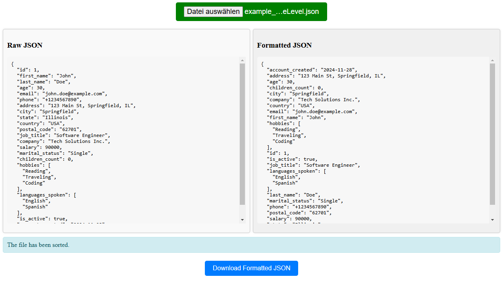

# Project: Multi-Level JSON Parser (Initially designed for sorting i18n files with multiple levels/nested hierarchy)



## Description
This simple project aims to organize and sort all keys within a JSON file, including multiple levels/nested hierarchy. The goal is to have all keys sorted alphabetically (multilevel) so that the file becomes more readable, easier to maintain, and better structured for adding new elements.

## Features
- **Alphabetical sorting of all keys**: All keys within the JSON file will be sorted in alphabetical order.
- **Multilevel sorting**: If the JSON files have multiple levels (hierarchy/nested elements/multi-level), the sorting will be applied at all levels.
- **Improved readability and structure**: Sorting keys makes JSON files more readable.
- **Simple HTML display**: The project includes a simple HTML display where you can upload/select a JSON file, showing both the RAW state and the state after sorting, and allows you to download the sorted JSON file.

## Requirements
- **Node.js**: Version 12.x or newer
- **Angular**: Version 12.x or newer

## Installation Instructions
1. **Clone the repository**:
    ```bash
    git clone https://github.com/dsoldo/multi-level-json-parser.git
    cd your-repository-name
    ```

2. **Install the required packages**:
    ```bash
    npm install
    ```

3. **Run the application**:
    ```bash
    ng serve
    ```

## Using the Sorting Tool
1. **Select a JSON file**

2. **After selecting and validating the JSON file, click SORT**

3. **If the JSON file is not identical to the RAW file, a Download button will appear, allowing you to download the sorted JSON file**

## Example

### RAW JSON:

```json
{
  "id": 1,
  "first_name": "John",
  "last_name": "Doe",
  "age": 30,
  "email": "john.doe@example.com",
  "phone": "+1234567890",
  "address": "123 Main St, Springfield, IL",
  "city": "Springfield",
  "state": "Illinois",
  "country": "USA",
  "postal_code": "62701",
  "job_title": "Software Engineer",
  "company": "Tech Solutions Inc.",
  "salary": 90000,
  "marital_status": "Single",
  "children_count": 0,
  "hobbies": ["Reading", "Traveling", "Coding"],
  "languages_spoken": ["English", "Croatian"],
  "is_active": true,
  "account_created": "2024-11-28"
}
```

After Format
```json
{
  "account_created": "2024-11-28",
  "address": "123 Main St, Springfield, IL",
  "age": 30,
  "children_count": 0,
  "city": "Springfield",
  "company": "Tech Solutions Inc.",
  "country": "USA",
  "email": "john.doe@example.com",
  "first_name": "John",
  "hobbies": ["Reading","Traveling","Coding"],
  "id": 1,
  "is_active": true,
  "job_title": "Software Engineer",
  "languages_spoken": ["English","Croatian"],
  "last_name": "Doe",
  "marital_status": "Single",
  "phone": "+1234567890",
  "postal_code": "62701",
  "salary": 90000,
  "state": "Illinois"
}
```
